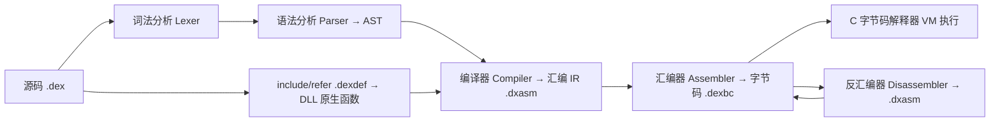

# DEXCODE — 自制字节码解释器工具链

一个完整的"自制语言"项目:一门小语言 **DexLang**,由 **Python 工具链**将源码先降级为**汇编形式(IR)**,再**汇编成字节码**,由 **C 编写的字节码解释器(VM)** 执行;字节码还可**反编译回汇编形式**;并支持通过 **include/refer** 引入 DLL 原生库——既支持动态链接,也支持 **`refer static` 静态链接**(把 DLL 字节内嵌进字节码,运行时无需外部 DLL)。

## 处理管线



- **Python 降级**:`源码 → AST → 汇编(IR)→ 字节码`
- **C 解释**:直接执行字节码;`NCALL` 指令通过 LoadLibrary 调用 DLL 导出函数
- **反汇编**:字节码 → 汇编(可再次汇编,往返一致)

## 目录结构

```
DEXCODE/
  main.py                  # CLI 入口
  ide_main.py              # DEXIDE 集成开发环境入口
  dexlang/                 # Python 工具链包
    lexer.py               # 词法分析
    parser.py              # 语法分析(AST)
    compiler.py            # AST → 汇编 IR(降级)+ include/refer + 编译期检查
    asmtext.py             # 汇编文本格式读写(.lib/.native/.func)
    assembler.py           # 汇编 → 字节码
    disassembler.py        # 字节码 → 汇编
    defparser.py           # .dexdef 定义文件解析
    pyvm.py                # Python 调试虚拟机(断点/单步/调用栈/原生调用)
    opcodes.py             # 操作码与字节码格式定义
  dexide/                  # DEXIDE 集成开发环境(Python + tkinter,零依赖)
    ide.py                 # 主窗口(侧边栏/标签页/底部面板/调试)
    editor.py              # 代码编辑器(断点槽/着色/悬停/自动补全)
    analyzer.py            # 项目分析(函数/调用图/原生库/问题)
    settings.py            # 用户设置(vm.exe 位置、库目录,持久化到 ~/.dexide.json)
    theme.py               # 主题与配色
  vm/vm.c                  # C 字节码解释器(单文件,含原生 FFI)
  libs/math/               # 数学库(libdexmath.dll + math.dexdef,演示 DLL 调用)
  libs/std/                # 标准库(纯 C 的 libdexstd.dll + std.dexdef,33 个函数)
  libs/img/                # 图片渲染库(libdeximg.dll + img.dexdef,ANSI 彩色)
  libs/ui/                 # WinAPI UI 库(纯 C 的 libdexui.dll + ui.dexdef,窗口/按钮/输入框)
  libs/egui/               # 🖼 EGUI 图形界面库(纯 C 的 libegui.dll + egui.dexdef,
                           #    11 种控件 + 信号式设计 + fast/base/static 多模式)
  libs/gal/                # 🎮 GAL 引擎(纯 C 的 libdexxgal.dll + gal.dexdef,
                           #    背景/立绘/打字机/选项/音频;文字位置、对话框风格
                           #    (头像/人名/自适应)、立绘动画(呼吸/淡入/上浮/抖动…)
                           #    stb_image 解码图片)
  libs/mylib/              # 语言模块库示例(用 DexLang 自身编写的 .dex 库)
  examples/*.dex           # 基础示例(hello/loop/functions/fib)
  examples/<库名>/         # 各库示例(use_math/use_img/demo_std/demo_ui)
  examples/egui/           # EGUI 演示(全部控件 + 信号)
  examples/gal/            # GAL 演示(背景/立绘/选项分支 + res 资源)
  dexide/designer.py       # 🎨 EGUI Designer 图形化界面设计器(生成 .dex)
  gal_main.py              # 🎮 GAL 蓝图编辑器启动入口(Python + tkinter,推荐)
  bluedit/                 # 🎮 GAL 蓝图编辑器(UE 风格节点连线:镜头入口/出口 +
                           #    说话/长对话/立绘/选项/代码/变量/if/逻辑/运算/镜头控制;
                           #    变量由引擎存储(跨镜头);ctypes 复用 libdexxgal.dll 实时预览/运行)
  galide/                  # 🎮 旧版 GAL 编辑器(Scratch 式指令块,已停用)
  tools/legacy_galedit_c/  # 🎮 旧版 GAL 编辑器(C 纯 GDI 自绘,已封存备用)
  tests/                   # 端到端测试(21 个文件 / 134 个测试函数 / 639 处断言)
  docs/quickstart.html     # 🚀 快速入门指南(新手首选,浏览器打开)
  docs/stdlib_guide.html   # 📚 标准库详解(33 个函数逐个讲解,含可运行示例)
  docs/ui_guide.html       # 🖥 WinAPI 与 UI 库教学(窗口/消息循环/事件)
  docs/egui_guide.html     # 🖼 EGUI 图形界面库教学(控件/信号/双模式/Designer)
  docs/designer_guide.html # 🎨 EGUI Designer 使用详解(画界面→生成代码→运行)
  docs/gal_guide.html      # 🎮 GAL 引擎与编辑器教学(打字机/选项/打包/编辑器)
  docs/SPEC.md             # 完整规格说明
  docs/TUTORIAL.md         # 教学文档
```

## 使用

```bash
# 0. 启动 DEXIDE 集成开发环境(建议)
python ide_main.py examples/fib.dex     # 或: python main.py ide examples/fib.dex

# 1. 构建 C 字节码解释器(需要 gcc/clang,或使用 zig cc)
python main.py build-vm

# 2. 源码 → 汇编 + 字节码
python main.py compile examples/fib.dex    # 生成 fib.dxasm 与 fib.dexbc

# 3. 用 C VM 执行字节码
python main.py run examples/fib.dexbc

# 4. 汇编文本 → 字节码
python main.py asm examples/fib.dxasm -o fib.dexbc

# 5. 字节码 → 汇编(反编译)
python main.py disasm examples/fib.dexbc -o fib.dxasm

# 6. 往返一致性校验(字节码 → 汇编 → 字节码)
python main.py roundtrip examples/fib.dexbc

# 7. 运行测试套件
python tests/test_toolchain.py && python tests/test_native.py \
  && python tests/test_pyvm.py && python tests/test_ide.py
```

### 🎮 GAL 视觉小说(蓝图编辑器)

```bash
# 运行 GAL 演示(背景/立绘/打字机/选项分支;点击推进,关闭窗口结束)
python main.py run examples/gal/demo_gal.dex

# 启动 GAL 蓝图编辑器(UE 风格节点连线)
python gal_main.py                            # 新建项目
python gal_main.py examples/gal/demo_blueprint.bluescene   # 打开示例蓝图

# 操作:
#   中央画布:拖引脚连线(金=执行流,蓝=数据流;入口输出绿/出口输入红)
#   滚轮缩放画布 · 拖节点移动 · 中键拖平移
#   左栏「块」:按住拖出添加节点;右键空白处可添加节点、右键连线可删除
#   右栏:选中节点改属性(竖排);「定义变量」自动登记变量供下拉引用
#   底部 ▶预览(内嵌引擎看背景)、▶运行(设置 VM 后编译并用 VM 打开游戏窗口)
# 导出可编译代码(项目根/scene_out.dex):菜单 文件 → 导出代码
#   编译: python main.py compile scene_out.dex
# 运行:菜单 设置 → 填「VM 位置」(vm/vm.exe 或 vm/galrun.exe)与编译器 →
#   ▶运行 自动导出→编译→打开游戏窗口,关闭窗口后回到编辑器继续编辑

# 蓝图文件格式: .bluescene(JSON);旧 .galscene/Scratch 编辑器已停用
```

# build-vm 会一次构建三个版本:vm.exe(控制台)/ vmnc.exe(无控制台)/ galrun.exe(发布版)
```

成品目录即插即玩,运行时仅需 `galrun.exe + core.do + res/`,无 Python 依赖。
详见 `docs/gal_guide.html`。

> 本机若无 gcc/clang,可通过 `pip install ziglang` 获得 Zig 内置的 C 编译器,
> 再执行 `python main.py build-vm`。示例 DLL 的构建:
> `zig cc -shared -target x86_64-windows-gnu -O2 -o libs/math/libdexmath.dll libs/math/libdexmath.c`

> **编码**:源码、汇编、字节码与输出全程 **UTF-8**。C VM 在 Windows 上会设置控制台为
> UTF-8 输出代码页;IDE「运行」按钮按 UTF-8 捕获子进程输出,因此 `print "你好,世界!!";`
> 在控制台/终端中都能正确显示中文。

## DEXIDE 集成开发环境

一个 VS Code 风格的 DexLang IDE(**Python + tkinter,零第三方依赖**,参考 JASON IDE 的
Catppuccin 暗色主题)。深度复用 DEXCODE 工具链,提供"真实而非玩具"的分析与调试:

| 能力 | 说明 |
|------|------|
| **丰富的着色** | 关键字/类型/数字/字符串/注释/运算符/函数调用/原生调用/变量/库路径,实时增量着色 |
| **语法提示** | `Ctrl+Space` / `Alt+/` + 可选自动触发补全(关键字/函数/原生函数/变量);悬停显示函数签名、arity、参数、调用关系 |
| **结构关系** | 大纲面板:函数(参数/arity/调用/被调用/调用点)、库引入、顶层变量,双击跳转 |
| **函数关系分析** | 全项目调用图:每个函数列出"调用/被调用",悬停显示调用者与被调用者 |
| **自动分析库** | 自动扫描各文件 `include`/`refer`,解析 `.dexdef`,在"库"面板聚合全部原生函数与签名 |
| **问题面板** | 用真实编译流程收集错误/警告(文件:行:列),双击跳转;红色波浪线实时标注 |
| **编译工具** | 工具栏/菜单「编译」:仅编译为汇编(当前 .dex → .dxasm 并打开查看)、汇编 → 字节码(当前 .dxasm → .dexbc);生成的汇编自带高亮 |
| **强大的调试** | 断点(点击行号槽)、继续/单步进入/跳过/跳出、调用栈、各帧局部变量、值栈、监视表达式;基于 Python 调试 VM(支持 DLL 原生调用) |
| **系统终端运行** | 一键把当前 `.dex` 编译并在系统默认终端(新窗口)运行,支持 ANSI 彩色输出与 stdin 交互(图片渲染、交互式程序) |
| **可配置 VM / 库位置** | 「设置」菜单自定义 vm.exe 路径与 include 库目录(自动适配项目 `libs/`;持久化到 `~/.dexide.json`) |
| **VS Code 风格** | 可关闭标签页、资源管理器、暗色主题、工具栏/菜单/状态栏、Ctrl+滚轮缩放 |

```bash
python ide_main.py                  # 打开当前目录
python ide_main.py examples         # 打开项目文件夹
python ide_main.py examples/fib.dex # 打开指定文件
python main.py ide examples/fib.dex # 等价
```

> **中文输入法(IME)兼容**:补全弹窗是"被动"形式——**从不抢占键盘焦点**(列表
> `takefocus=0`、显式 `focus_force` 把焦点保持在编辑器、导航键绑定在编辑器上),
> 因此即使输入拼音时自动弹出补全,**输入法组合也不会被终止**(与 JASON IDE 同机制)。
> 自动补全**默认开启**;如需关闭可在「视图」菜单取消勾选"输入时自动补全"。
> 也可随时按 `Ctrl+Space` / `Alt+/` 手动触发。

> 调试器说明:IDE 的"调试"使用 `dexlang/pyvm.py`(与 C VM 语义一致的 Python 实现,
> 支持断点/单步/帧/监视,并通过 ctypes 调用 DLL),从而做到真正的源码级交互调试;
> "运行"按钮则调用 C VM 执行。两者输出一致。

## 引入 DLL 原生库(include / refer)

**定义文件 `math.dexdef`** 声明库接口(类型:int/float/string/void):

```
refer "libdexmath.dll";

extern func dex_add(a: int, b: int) -> int;
extern func dex_fact(n: int) -> int;
extern func dex_sqrt(x: float) -> float;
extern func dex_len(s: string) -> int;
extern func dex_hello() -> string;
```

**主代码**中引入后即可像普通函数一样调用:

```c
include "math";     // 或: refer "libs/math/math.dexdef";

print dex_add(2, 3);       // 5
print dex_fact(5);         // 120
print dex_sqrt(9.0);       // 3
print dex_hello();         // hello from dll
```

- `include "名称"`:在源码目录、`libs/`(及其子目录)与 `-L` 目录搜索 `名称.dexdef`
- `refer "路径"`:显式指向定义文件
- `refer static "路径"`:静态链接——编译器把 DLL 字节内嵌进字节码,运行时解包到临时文件加载,分发时无需外部 DLL
- 编译器根据定义文件检查**参数个数**与**字面量类型**
- 当前 FFI 支持参数/返回类型为 `int`/`float`/`string`(参数 ≤ 3,见 SPEC;含 `(string,string)`、`(string,int)`、`(string,int,int)` 组合)

**字符串所有权(重要)**:原生函数返回的 `const char*` 是**借用** ——
VM 会立即复制一份进自己的堆并使用副本,从不释放原生指针。因此库作者可以放心返回
静态/常驻缓冲区,不必为返回值的内存负责。

若某个库需要返回**堆分配**的字符串,可在自己的 `.dexdef` 里额外声明一个
`(string) -> void` 的函数,它会被认作该库的释放函数,VM 在复制完返回值后
用**原生原始指针**调用它,从而不泄漏:

```
refer "libfoo.dll";
extern func foo_name(id: int) -> string;
extern func foo_free(p: string) -> void;   # (string)->void = 本库的释放函数
```

详见 `docs/SPEC.md` 4.6 与回归测试 `tests/test_memmodel.py`。


## 标准库(纯 C 实现,零 Python)

`libs/std/` 提供一套**完全由 C 编写**的标准库 `libdexstd.dll`,由 DexLang 通过 `include "std"` 使用:

- **math** 数学:`dex_abs/fabs/pow/fmin/fmax/imin/imax/floor/ceil/round`
- **string** 字符串:`dex_strlen/upper/lower/trim/concat/repeat/sub/contains/itoa/ftoa`
- **io** 文件与输入:`dex_read_file/write_file/append_file/file_exists/remove_file/input/print/out`
- **time** 时间:`dex_now_ms/sleep_ms`;**random** 随机:`dex_rand/srand`;**system** 系统:`dex_system`

标准库不包含任何 Python 脚本;使用 `refer static` 可把整个标准库内嵌进字节码。
编译一次后,**运行时完全脱离 Python**:只需 `vm.exe`(纯 C 字节码解释器)+ 一个 `.dexbc`,
无需 Python、无需外部 DLL(`tests/test_stdlib.py` 会移走 DLL 后直接用 `vm.exe` 验证)。

```c
include "std";
print dex_abs(-5);                 // 5
print dex_str_upper("hi");         // HI
print dex_write_file("a.txt", "x"); // 0
print dex_now_ms() > 0;            // 1
```

## DexLang 语言(第 1 版)

```c
// 递归斐波那契
func fib(n) {
    if n < 2 {
        return n;
    }
    return fib(n - 1) + fib(n - 2);
}

let i = 0;
while i <= 10 {
    print fib(i);
    i = i + 1;
}
```

- 类型:int64 / float64 / string(动态类型,带标签)
- 语句:`let` 声明、赋值、`print`、`if/else`、`while`、`func`、`return`、`include`/`refer`
- 表达式:算术 `+ - * / %`(`+` 遇字符串即拼接,数字自动转字符串)、比较 `== != < <= > >=`、逻辑 `&& ||`(短路)、一元 `! -`、函数调用
- 变量为函数作用域;`/` 恒为浮点结果;`%` 仅整数;`print` 每个值输出一行

## 汇编形式(.dxasm 示例)

```
.lib "C:\...\libdexmath.dll"
.native dex_add 0 ii:i
.func main 0
    PUSH 0
    STORE %0
L10:
    LOAD %0
    PUSH 10
    LE
    JZ L58
    CALL @fib
    PRINT
    JMP L10
L58:
    HALT
```

栈式指令集;局部变量用 `%N` 槽位;普通函数 `@name`、原生函数 `NCALL name`;跳转目标为符号标签。

## 字节码格式(.dexbc)

二进制小端序:18 字节头部(魔数 `DEXC` + 版本 + 常量/函数/库/原生函数数 + 代码长度)、
常量池(INT/FLOAT/STRING)、库表、原生函数表、函数表(每项 13 字节)、代码段
(指令 = 1 字节操作码 + 可选 4 字节操作数)。详见 `docs/SPEC.md`。

## 构建原生库

`python main.py build-vm` 只构建 VM。六个原生库(`libs/*/lib*.dll`)用:

```bash
build_libs.bat          # 需要 ziglang(pip install ziglang)
```

各库源码头部的注释是该库的权威构建命令(例如 `libdexxgal.c` 需要
`-lgdi32 -luser32 -lwinmm -lmsimg32`)。脚本会把 zig 缓存重定向到工作区内的
`_zigcache/`、`_zigtmp/`(已被 `.gitignore` 排除),避免在受限环境下写
`%LOCALAPPDATA%\zig` 被拒。

## 开发约定

**编码**:所有源文件为 **UTF-8 无 BOM**。

> **不要用 PowerShell 的 `Set-Content` / `Out-File` 重写源码文本文件。**
> PowerShell 5.1 会把 UTF-8 内容按 GBK 解读后再按 UTF-8 写出,导致中文注释
> 全部变成乱码,并加上 BOM。本项目 `vm.c` 曾因此损坏 118 行,只能靠打包目录
> 里的旧快照恢复。请使用支持 UTF-8 的编辑器,或用 `git` 做文本替换。
> 若必须用脚本批量改写,请用 Python 且显式指定
> `open(path, 'w', encoding='utf-8', newline='\n')`。

> **编辑既有文件时不要把 CRLF 改成 LF。** 仓库原本是混合换行(原有 `.py`/`.md`
> 为 CRLF,`.c` 为 LF)。若整个文件被改成 LF,`git diff` 会显示全文件重写,
> 掩盖真实改动。仓库不再使用 `.gitattributes`,以免 git 反复做换行规范化。
> `.bat` 目前是 LF,cmd.exe 可正常执行(已实测 `build_libs.bat`)。

**提交前**:工作树必须干净,且 `python tests/test_*.py` 全通过。

**生成产物不入库**:`*.dxasm`、`*.dexbc`、`*.do`、`scene_out.dex` 等可由
`.dex` 源码重建,原因见 `.gitignore` 中的注释。


## 测试

共 **21 个测试文件 / 134 个测试函数 / 639 处断言**（`check(...)` 调用点；实际执行数
随平台与是否构建 `vm.exe` 而变，本机实测 388 项通过、0 失败）。

```bash
python tests/test_toolchain.py   # 33 项:核心工具链 + C VM 执行 + 往返
python tests/test_native.py      # 34 项:include/refer + 定义文件 + 错误检查 + DLL 调用 + 中文
python tests/test_static.py      # 17 项:静态链接(字节内嵌、v3 往返、无外部 DLL 运行)
python tests/test_stdlib.py      # 25 项:标准库(纯 C 实现 + 脱离 Python 运行)
python tests/test_struct.py      # 14 项:type/结构体 + 双 VM 一致性
python tests/test_pyvm.py        # 15 项:Python 调试 VM(断点/单步/调用栈/原生/中文)
python tests/test_ide.py         # 49 项:DEXIDE 分析器 + GUI + IME 安全 + 编译工具 + 终端运行
python tests/test_bluedit.py     # 185 项:GAL 蓝图模型/序列化/导出可编译
python tests/test_robust.py      # 25 项:健壮性回归(畸形字节码/循环对象/类型校验/整型边界)
python tests/test_memmodel.py    # 27 项:内存模型(P0 统一堆入口/P1 预算/P2 FFI 所有权)
# 其余:test_call / test_module / test_img / test_ui / test_egui / test_gal /
#       test_galide_py / test_designer / test_editor / test_nopydep / test_vm_versions
```

覆盖:词法、语法、AST、编译降级、汇编、反汇编、**字节码↔汇编往返一致性**、
C VM 执行(算术 / **字符串拼接** / if-else / while / 递归 / 短路逻辑 / **DLL 原生调用** / **静态内嵌库**)、
编译期错误检查(原生 arity/类型、顶层 return、除零、重复引入、不可达代码警告、**字段赋值类型**)、
IDE 分析器(函数/调用图/原生库/补全/悬停/问题)与 GUI 调试联动。

## 已知限制

- **运行期不释放堆内存**：字符串拼接(`CONCAT`)、原生函数的字符串返回值、结构体实例
  (`MAKE_OBJ`)所产生的堆对象在进程退出前不会释放。因此 `while ... { s = s + "x"; }`
  这类循环会持续增长内存。没有实现 GC 是刻意的：结构体字段是引用语义，
  `let t = mk(); let b = Box{name: t}; t = "x";` 之后字段与局部槽指向同一块内存，
  按槽释放会让字段悬垂。正确做法是引用计数或标记清扫，需枚举栈/局部槽/对象字段作为根。
  `tests/test_robust.py::test_string_flow_aliasing` 固化了这一约束。
  **缓解**:VM 有内存预算机制 —— 设置环境变量 `DEXCODE_MAX_MEM_MB`(单位 MB,`0`=不限,默认不限)
  后,用量超过上限会以明确错误退出,并指出"循环内字符串累加"这一最常见原因,
  而不是静默涨到被系统 OOM 杀掉。分配已收口到 `vm_alloc`/`vm_calloc`,
  因此这是将来引入回收策略的单一插入点。
- **FFI 参数个数 ≤ 3**：没有 libffi，参数编组是手写的分支表，组合数按 4^N 增长。
  注意 `.dexdef` 里写超过 3 个参数**不会**在编译期报错，要到第一次 `NCALL` 才失败。
- **`.dexbc` 视为可信输入**：字节码可以指定任意 DLL 路径与符号名并调用。VM 已做
  加载期校验(函数 code 区间、指令对齐、`nlocals >= arity`)，但它不是沙箱。


